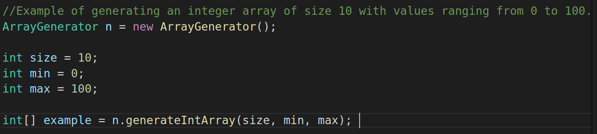

# Array Generator

ArrayGenerator is a tool used to generate arrays of a specified data type.
Each slot in the array is a randomly generated value.

# How It Works

Create an instance of the class ArrayGenerator and use that instance to initilaze a new array. 

# License
[BSD 3-Clause](https://github.com/PinedaVictor/ArrayGenerator/blob/master/LICENSE)
